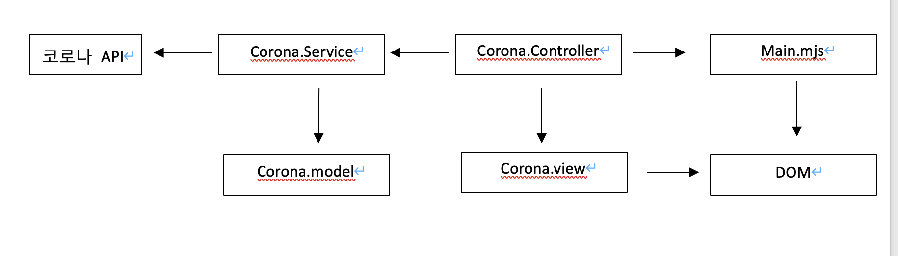

## 코로나 현황 안내 사이트(토이프로젝트)

#### 코로나 API를 활용한 국내 코로나 확진자,위중증자,사망자,검사자 등 정보 안내 사이트

## 기능 정리

#### 당일 확진자 조회

- 확진자
- 사망자
- 입원환자
- 위중증자

#### 일별,주별 확진자 그래프 조회

- 확진자
- 위중증자
- 사망자
- 검사자

#### 지역별 확진자 리스트 조회

- 지역
- 확진자
- 사망자
- 10만명당 확진자

#### SVG 지도 컴포넌트 생성 및 지역별 지도 조회(심화주제)

- 지역별 당일 확진자,사망자 조회

## 참조

#### 참고 사이트: https://corona-live.com/

#### 코로나 API: https://api.corona-19.kr/

#### 깃허브: https://github.com/KIMHWANSEUNG/Corona_Toy/

#### 그래프 차트js: https://www.chartjs.org/docs/latest/samples/information.html

### MVC 설계:

